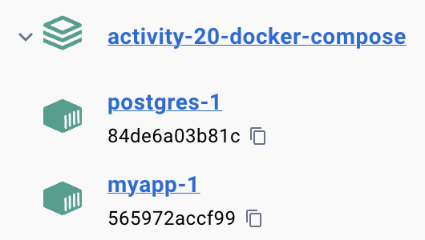

# Introduction

So far, the architecture of the web applications developed in this course has consisted of only two layers: the client (browser) and the web server (the Flask app). This activity will introduce a more realistic three-layer architecture by adding a database layer running on its own container. 

# Docker Compose 

[Docker Compose](https://docs.docker.com/compose/) is a tool for defining and running **multi-container** Docker applications. With Compose, you use a YAML file to configure your application's services. For this activity, we will be defining two services, named: **posgres** and **myapp**. 

## The Postgres Service 

Postgres is a popular relational database. Up to this point, we have been using sqlite, an embedded database. For this activity, the **postgres** (container) service will be built from a public image available from Docker Hub. The container service will be configured using parameters to map ports, set the database, user and password, and a volume mapping to allow saving the database outside the container in a host’s folder.

To set the database host's folder, create a **postgres** folder and find out its absolute path. Then replace **<postgres absolute path>** under **services - postgres - volumes** in the **docker-compose.yml** file. 

Finally, the **postgres** service has a **healthcheck** parameter that can be used to tell whether the service is available of not. 

## The MyApp Service

The **myapp** (container) service is the Flask web app. The app's image will be built from the **Dockerfile**. The **depends_on** parameter tells Docker composer that **myapp** depends on the **postgres** service being health. 

## Deployment

Once configuration files **docker-compose.yml** and **Dockerfile** are ready, the architecture can be built by issuing: 

```
docker compose up
```

As specified in the YAML file, the **postgres** service should be initialized first. Only when that service is "healthy" and ready to accept connections, then the **myapp** service is started. 


